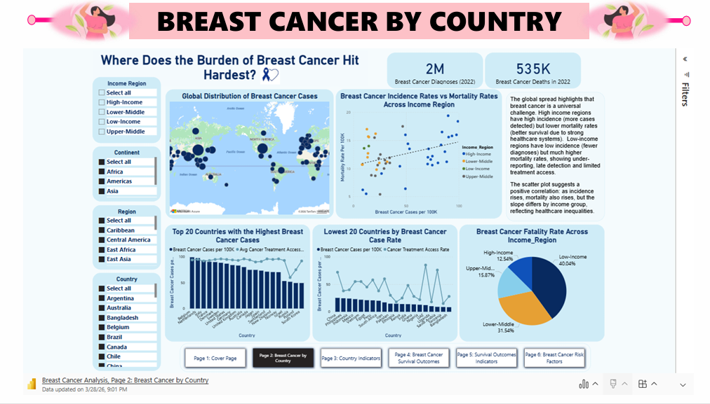
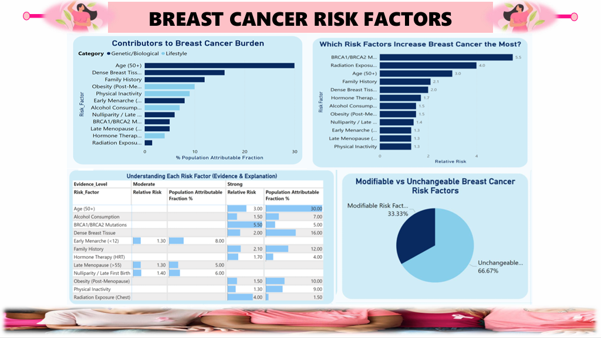

# 🌍 Global Breast Cancer Analysis
## Project Overview
This project analyzes global breast cancer statistics, risk factors, survival outcomes, and healthcare inequalities using three datasets covering 50 countries, risk factors, and survival by cancer stage.

The solution provides:
* A clear understanding of how breast cancer burden varies across income regions.
* Insights into early vs late diagnosis, screening access, treatment equity, and survival outcomes.
* A structured dashboard showing trends in incidence, mortality, screening coverage, treatment access, and survival patterns.
* Analytical models that identify gaps between high-income and low-income settings, helping guide public health decisions. 

Overall, this project supports global efforts to improve early detection, timely diagnosis, and treatment completion. It aims to provide actionable insights for **public health leaders, cancer researchers, and policymakers**; and also transform raw epidemiological data into clear evidence that supports **equitable cancer care strategies** worldwide.

---

## 🔍 Problem Statement
Breast cancer is the most common cancer among women globally, yet outcomes remain highly unequal:
- High-income countries detect more cases but achieve far higher survival rates.
- Low- and lower-middle-income regions detect fewer cases but face disproportionately high fatality rates.

These disparities are driven by limited screening, delayed diagnosis, restricted access to modern treatments, and resource constraints. Without targeted interventions, inequalities will persist and the global burden will continue to rise.

---

## 🎯 Objectives
This analysis was designed to:
1. Compare global breast cancer incidence and mortality patterns.
2. Examine survival outcomes across income regions and cancer stages.
3. Evaluate disparities in fatality rates across income groups.
4. Assess early-stage detection patterns and screening effectiveness.
5. Analyze treatment patterns and equity across regions.
6. Explore the distribution and impact of risk factors worldwide.

---

## 🔧 Tools & Technologies
**Data Sources:** WHO Global Breast Cancer Initiative, IARC/GlOBOCAN, CDC, Cancer Research UK, Kaggle datasets.

**Tools:**
* 🖥️ Power BI Desktop – Data import, modeling, relationships, DAX calculations, interactive dashboards
* 📊 Microsoft Excel – Data cleaning, exploratory analysis, and quality checks
* 🔄 Power Query – Data transformations and preparation
* 🧮 DAX (Data Analysis Expressions) – Calculated columns and measures
* 🎨 PowerPoint – Presentation and storytelling visuals 

**Technologies & Methods:**
* 🧱 Data modeling (Star Schema)
* Lookup table creation (DimIncomeRegion)
* ETL using Power Query
* DAX measures for survival rates, early-stage diagnosis, late-stage diagnosis
* Scatter plots, bar charts, heatmaps, and KPI cards

---

## 🛠️ Methodology / Implementation
The workflow followed a data analysis pipeline:
* 📥 **Data Collection:** Gathered datasets from Kaggle. Reviewed all 3 datasets:
  * Breast cancer by country (50 countries)
  * Risk factors dataset (12 factors)
  * Breast Cancer Survival-by-stage dataset (20 entries)
* 🧹 **Data Cleaning:** This was performed in Excel and Power BI; removed trailing spaces in country names; Standardized stage labels; Fixed text encoding errors (e.g., “Surgery ± radiation”); Converted TRUE/FALSE fields to Yes/No for readability; Changed numeric fields to appropriate types (whole number vs decimal).
* 🗂️ **Data Modeling:** Created a DimIncomeRegion lookup table mapping each of the 50 countries to income groups in Excel, because income groups is only present in Breast Cancer Survival by Stage but not in Breast Cancer by Country dataset. Linked Country Table to DimIncomeRegion, and Survival Table to DimIncomeRegion. Risk factors dataset kept separately (no relationship needed).
* ⚙️ **Feature Engineering:** Created calculated columns and measures such as: Stage Group (Early vs Late), Early Diagnosis % , Late Diagnosis %  etc.
* 📈 **Analysis and Visulaization:** Built scatter plots, bar charts, and survival tables to compare incidence vs. mortality, stage at diagnosis, treatment outcomes etc.
* 📝 **Insights & Recommendations:** Summarized key findings on inequlities, treatment gaps, screening coverage, stage and survival trends, etc.
* 🎤 **Final Presentation:** Designed a clear, concise report with power point showing executive summary, key visual, insights for decision makers, and recommendation for improving early detection and treatment equity.

---

## 📈 Dashboard Highlights
- **Global Diagnoses (2022):** 2M cases  
- **Global Deaths (2022):** 535K  
- **Fatality Rates by Income Region:**  
  - High-Income: 12.5%  
  - Upper-Middle: 15.9%  
  - Lower-Middle: 31.5%  
  - Low-Income: 40.0%  

### Sample Dashboard Screenshots
**Global Breast Cancer by Country Overview Dashboard**

**Breast Cancer by Country II**  

**Survival Outcomes by Stage**  

**Breast Cancer Survival Indicators**  

**Risk Factors Contribution**  

---

## 🔑 Key Insights
- **Global Paradox:** Wealthier nations detect more cancers but save more lives; poorer nations detect fewer cancers but lose more lives.  
- **Screening Impact:** Countries with national screening programs detect 72% of cases at early stages, compared to 28% without.  
- **Stage Survival:** Stage 0 has a 10-year survival of 85%, while Stage IV drops to just 6%.  
- **Treatment Equity:** High-income regions provide multimodal treatments; low-income regions often rely on delayed surgery, chemotherapy, or palliative care.  
- **Risk Factors:** Age 50+ accounts for ~30% of cases; BRCA mutations and radiation exposure carry the highest relative risk, while lifestyle factors (obesity, inactivity, alcohol) contribute ~5–10% each.

---

## 📌 Recommendations
1. Expand national mammography programs in low- and middle-income regions.  
2. Invest in treatment infrastructure (radiotherapy, surgical centers, oncology units).  
3. Increase public awareness and education on early detection.  
4. Address modifiable lifestyle risks (obesity, inactivity, alcohol use).  
5. Provide financial and global support for low-resource regions.  
6. Strengthen cancer registry accuracy and monitoring systems.  
7. Promote global equity in cancer care through international collaboration.  

---

## ✅ Conclusion
Breast cancer outcomes should not depend on geography. This project demonstrates that disparities are driven not by biology but by **access to screening and treatment**. Strengthening early detection, expanding treatment infrastructure, and addressing lifestyle risks can significantly reduce the global burden and ensure survival is determined by care, not income region.

---

## 📊 Project Deliverables
- **Power BI Dashboard**: Interactive dashboard analyzing global breast cancer incidence, survival outcomes, and risk factors.  
  👉 [View the Live Dashboard and Interact with it](https://app.powerbi.com/view?r=eyJrIjoiMzVlMzhlYjktZDY0OS00NWZhLTg1YzUtNGVmODVlODMwNThlIiwidCI6IjAyMDk2OWQ5LTgyNzMtNGVjOC05Y2YyLTMzYTU1NWM1YmFhMiJ9)

---

## 👤 Author
**Light Amadi**  
Global Breast Cancer Analysis Project  
🌐 [www.linkedin.com/in/light-amadi-942628360]
