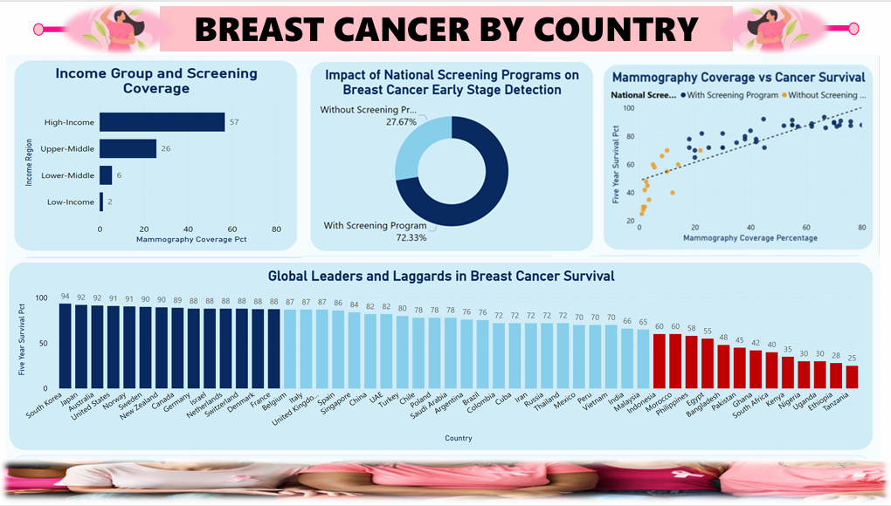
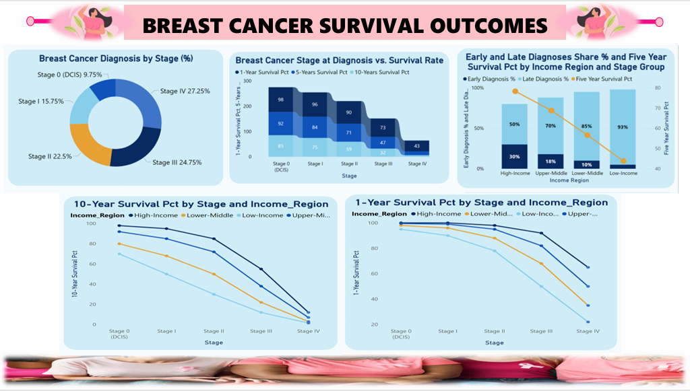
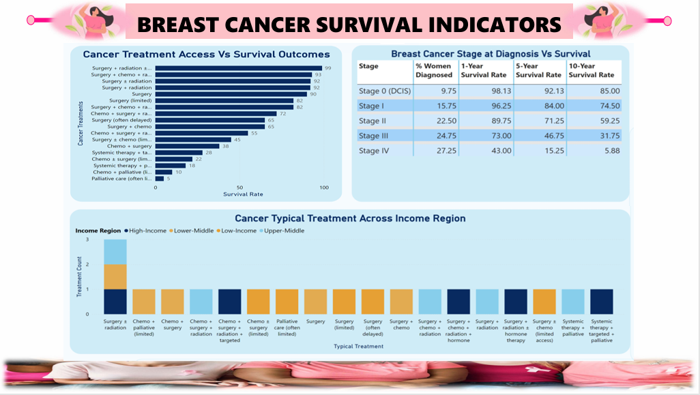

# 🌍 Global Breast Cancer Analysis
## Overview
This project investigates the **global burden, outcomes, and risk factors** of breast cancer using datasets on incidence by country, survival outcomes by stage, and risk factor distribution. The analysis highlights disparities in detection, treatment, and survival across income regions, aiming to provide actionable insights for **public health leaders, cancer researchers, and policymakers**.

The goal is to transform raw epidemiological data into clear evidence that supports **equitable cancer care strategies** worldwide.

---

## 🔍 Problem Statement
Breast cancer is the most common cancer among women globally, yet outcomes remain highly unequal:
- High-income countries detect more cases but achieve far higher survival rates.
- Low- and lower-middle-income regions detect fewer cases but face disproportionately high fatality rates.

These disparities are driven by limited screening, delayed diagnosis, restricted access to modern treatments, and resource constraints. Without targeted interventions, inequalities will persist and the global burden will continue to rise.

---

## 🎯 Objectives
This analysis was designed to:
1. Compare global breast cancer incidence and mortality patterns.
2. Examine survival outcomes across income regions and cancer stages.
3. Evaluate disparities in fatality rates across income groups.
4. Assess early-stage detection patterns and screening effectiveness.
5. Analyze treatment patterns and equity across regions.
6. Explore the distribution and impact of risk factors worldwide.

---

## 📈 Dashboard Highlights
- **Global Diagnoses (2022):** 2M cases  
- **Global Deaths (2022):** 535K  
- **Fatality Rates by Income Region:**  
  - High-Income: 12.5%  
  - Upper-Middle: 15.9%  
  - Lower-Middle: 31.5%  
  - Low-Income: 40.0%  

### Sample Dashboard Screenshots
**Global Breast Cancer by Country Overview Dashboard**

**Breast Cancer by Country II**  

**Survival Outcomes by Stage**  

**Breast Cancer Survival Indicators**  

**Risk Factors Contribution**  

---

## 🔑 Key Insights
- **Global Paradox:** Wealthier nations detect more cancers but save more lives; poorer nations detect fewer cancers but lose more lives.  
- **Screening Impact:** Countries with national screening programs detect 72% of cases at early stages, compared to 28% without.  
- **Stage Survival:** Stage 0 has a 10-year survival of 85%, while Stage IV drops to just 6%.  
- **Treatment Equity:** High-income regions provide multimodal treatments; low-income regions often rely on delayed surgery, chemotherapy, or palliative care.  
- **Risk Factors:** Age 50+ accounts for ~30% of cases; BRCA mutations and radiation exposure carry the highest relative risk, while lifestyle factors (obesity, inactivity, alcohol) contribute ~5–10% each.

---

## 🛠 Tools & Technologies
- **Power BI** → Data modeling and visualization  
- **Data Analysis Techniques** → Survival analysis, incidence vs mortality comparisons  
- **Visualization Methods** → Scatter plots, bar charts, pie charts, dashboards  

---

## 📌 Recommendations
1. Expand national mammography programs in low- and middle-income regions.  
2. Invest in treatment infrastructure (radiotherapy, surgical centers, oncology units).  
3. Increase public awareness and education on early detection.  
4. Address modifiable lifestyle risks (obesity, inactivity, alcohol use).  
5. Provide financial and global support for low-resource regions.  
6. Strengthen cancer registry accuracy and monitoring systems.  
7. Promote global equity in cancer care through international collaboration.  

---

## ✅ Conclusion
Breast cancer outcomes should not depend on geography. This project demonstrates that disparities are driven not by biology but by **access to screening and treatment**. Strengthening early detection, expanding treatment infrastructure, and addressing lifestyle risks can significantly reduce the global burden and ensure survival is determined by care, not income region.

---

## 📊 Project Deliverables
- **Power BI Dashboard**: Interactive dashboard analyzing global breast cancer incidence, survival outcomes, and risk factors.  
  👉 [View the Live Dashboard and Interact with it](https://app.powerbi.com/view?r=eyJrIjoiMzVlMzhlYjktZDY0OS00NWZhLTg1YzUtNGVmODVlODMwNThlIiwidCI6IjAyMDk2OWQ5LTgyNzMtNGVjOC05Y2YyLTMzYTU1NWM1YmFhMiJ9)

---

## 👤 Author
**Light Amadi**  
Global Breast Cancer Analysis Project  
🌐 [www.linkedin.com/in/light-a-942628360]
